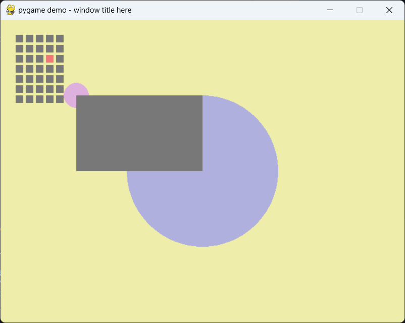
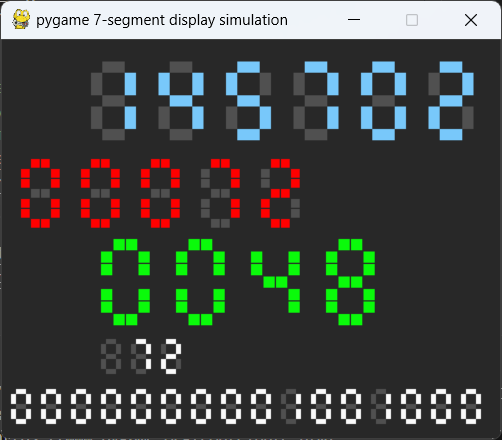
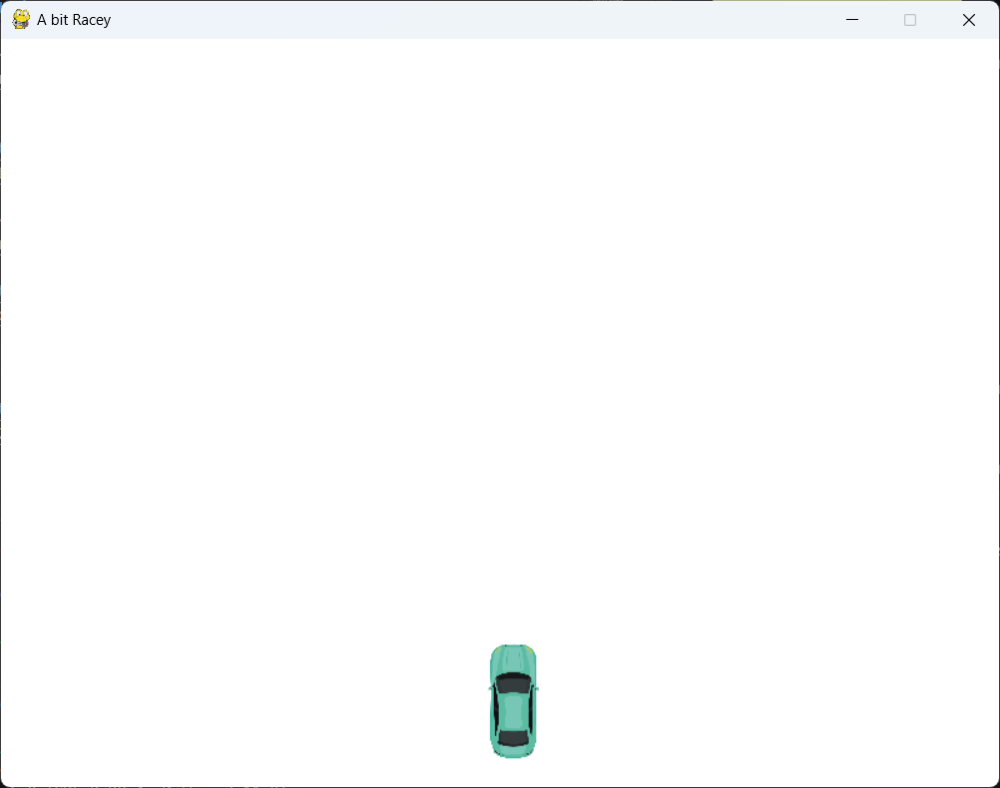

# pygame_samples

 - demo_01.py: pygameの超簡単なデモ。
 - demo_02.py: 7セグのシミュレーション、各セグメントを2ブロックで構成。Seven_segクラス使用。
 - demo_LCD_font.py: 5x7のLCDフォント制作用。LCD_fontクラス使用。

 - demo_freetype.py: pygame.freetypeでテキスト表示。（新しい方式）
 - demo_freetype.py: pygame.fontでテキスト表示。（古い方式）
 - demo_openmoji.py: オープンソースの絵文字、openmojiのデモ。キー操作のデモ。
 - seven_seg_pg.py: Seven_segクラス
 - lcd_font_pg.py: LCD_fontクラス

## demo01_.py
<!-- [alt text](readme_images/image.png)
 -->
<!--  -->

https://github.com/user-attachments/assets/d85d1232-9b1c-4a94-9515-3d048d42ebaf

## demo02_.py

https://github.com/user-attachments/assets/0dbf2212-5cf3-43f2-9a04-18e2ff72cc85

## demo_car_crash.py

https://github.com/user-attachments/assets/82b29e5f-3c52-4029-8a20-d22ea09d3300

